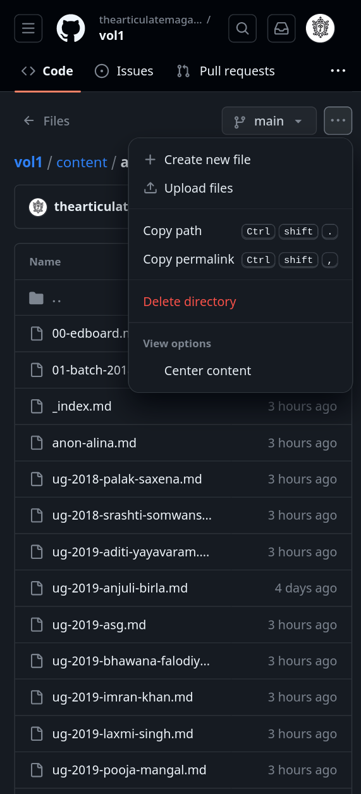

# Uploading new file

1. Go to [github.com](https://github.com/) and sign in.
2. Open the repo `thearticulatemagazine/vol1` or whichever volume is the latest at the time.
3. In desktop, the repo will open to a page with all the relevant files. In mobile view, you may have to click on the `View Code` link to view the files.

4. Open the appropriate folder. From the overflow menu in the upper right corner, select `Upload files`

5. Select the files from your desktop/mobile.